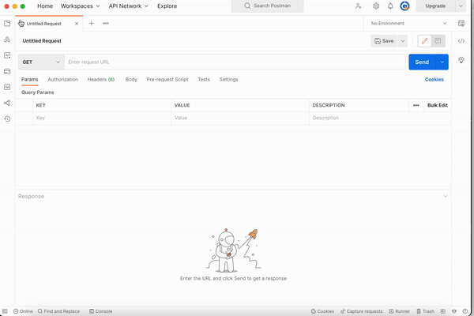

## Efficient API Testing with Postman: A Comprehensive Guide

One tool that is commonly used for API testing is Postman.

To use Postman for API testing, you can follow these steps:

1. Install Postman on your computer.

2. Create a new request in Postman. You can choose from various request methods such as GET, POST, PUT, DELETE, etc. depending on the purpose of your request.

3. Set the request URL to the API endpoint that you want to test.

4. Add any necessary headers, query parameters, or body data to the request.

5. Send the request and view the response.

6. Examine the response to see if it meets your expectations. You can use the built-in testing and validation features in Postman to automate this process.

Postman also has many other features that can be useful for API testing, such as the ability to save requests for later use, create and organize collections of requests, and create and run automated API tests.
Following gif is the result of this simple 'facts' API which runs via Cypress CLI and Cypress Chrome UI. Additionally, Postman is used to validate the status of the API and verification of the respond...

---

---
